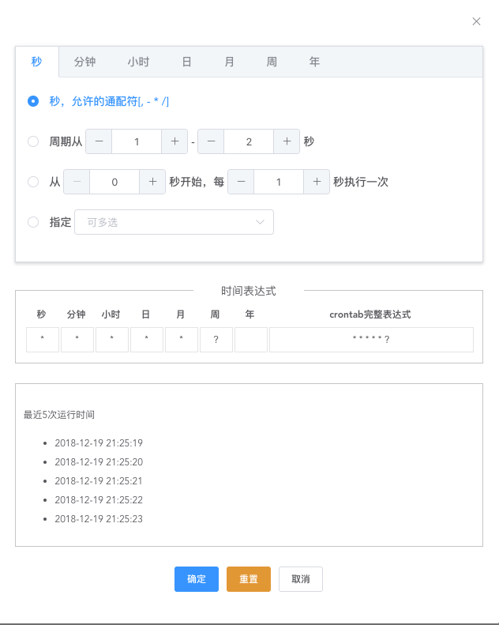

# vue-crontab
vue 的 cron 组件，支持解析/反解析 cron 表达式，生成最近五次的符合条件时间，依赖 vue2 和 element-ui
[demo](https://small-stone.github.io/vCrontab/dist/)


## 安装方式
```
npm install vcrontab
```

## 引入方式
```javascript
//全局引入
import vcrontab from 'vcrontab'
Vue.use(vcrontab);//使用方式：<vcrontab></vcrontab>

//单独引入
import vcrontab from 'vcrontab'
export default {
    components: { vcrontab }
}
```

## 参数
- expression
传入的 cron 表达式，可以反解析到 UI 上

## 方法
- fill
点击确定时，把选择好的值返回。

- hide 
关闭组件时的回调
